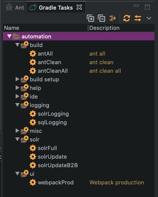
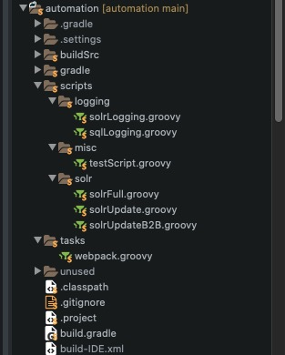
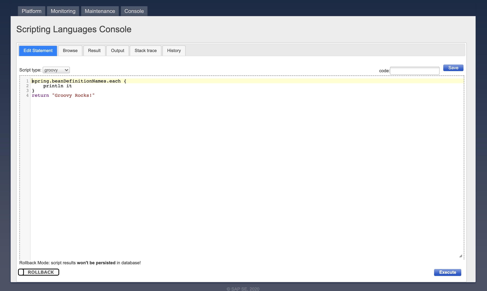

# automation

Automation is a gradle project to help automate all things when working with a hybris project. Easily create custom tasks and groovy scripts for your specific project. Just create a fork for your project and add/update scripts to automate various tasks in the project.

## Setup
1. clone project from your home directory

		cd ~
		git clone https://github.com/joebodo/automation.git

   This will create, for example: /Users/bob/automation

2. copy gradle.properties-EXAMPLE to gradle.properties

		cd automation
		cp gradle.properties-EXAMPLE gradle.properties

3. edit gradle.properties to include correct paths

4. In Intellij, click File -> New -> Module from existing sources...

    select the automation project and select Gradle when prompted.

5. For toolbar buttons, external tool setup:

    File -> Manage IDE Settings -> Import settings

    Select the intellij-settings.zip in the automation folder

## Key features
* Run groovy scripts from IDE
* Enable logging for class open in Editor
* Run integration test for class open in Editor
* Easily add scripts for repetitive tasks  (ie. running a cronjob)

## Custom tasks
Custom tasks can be added in the tasks folder. Custom tasks can invoke shell scripts, ant targets, etc.

## Custom scripts
Groovy scripts are sent and executed in Hac.

Drop groovy scripts into the scripts folder and a corresponding gradle task will be created.

 

## Hac customizations (optional)
Run the setup->customizeHac to apply the customizations seen here

